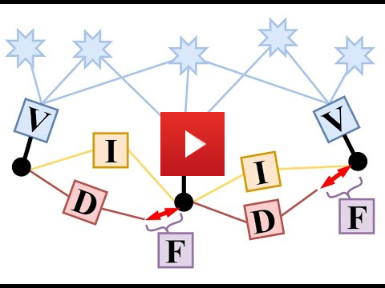

# VIMO
## Visual-Inertial Model-based State and External Forces Estimator

<a href="https://youtu.be/t2GdZZp7xQE" target="_blank"></a>

VIMO is a visual-inertial state and force estimator for multicopters. It incorporates robot's dynamic model in an optimization-based visual-inertial odometry system, such as [VINS-Mono](https://ieeexplore.ieee.org/document/8421746?arnumber=8421746&source=authoralert), to additionally provide external force estimates. Similar to IMU pre-integration, it preintegrates collective thrust generated by the propellors to form dynamic factors which, together with IMU factors, help distinguish between commanded motion and external disturbance.

If you use VIMO in an academic context, please cite the following paper:

**VIMO: Simultaneous Visual Inertial Model-based Odometry and Force Estimation**, Barza Nisar, Philipp Foehn, Davide Falanga, Davide Scaramuzza (RSS/IEEE-RAL, 2019), [pdf](http://rpg.ifi.uzh.ch/docs/RSS19_Nisar.pdf)

<!-- add bibtex entry -->

## 1. Prerequisites
1.1 **Ubuntu** and **ROS**
Ubuntu  16.04 or newer
ROS Kinetic or newer. [ROS Installation](http://wiki.ros.org/ROS/Installation)
additional ROS pacakge
```
    sudo apt-get install ros-YOUR_DISTRO-cv-bridge ros-YOUR_DISTRO-tf ros-YOUR_DISTRO-message-filters ros-YOUR_DISTRO-image-transport
```

1.2. **Ceres Solver**
Follow [Ceres Installation](http://ceres-solver.org/installation.html), remember to **make install**.
(Our testing environment: Ubuntu 18.04.3, ROS Melodic, OpenCV 3.4.9, Eigen 3.3.4) 

## 2. Build VIMO on ROS
Clone the repository and catkin_make:
```
    cd ~/catkin_ws/src
    git clone https://github.com/uzh-rpg/rpg_quadrotor_common
    git clone https://github.com/catkin/catkin_simple
    git clone https://github.com/ethz-asl/eigen_catkin
    git clone https://github.com/uzh-rpg/vimo.git
    cd ../
    catkin_make
    source ~/catkin_ws/devel/setup.bash
```

**Note: Current VIMO version fails if control commands are zero.** Therefore, it is recommended to run it offline on datasets and ros bags. 

## 3. VIMO on Public datasets

We can only run VIMO on datasets that contain motor speeds or control commands. One such dataset is [Blackbird Dataset](https://github.com/mit-fast/Blackbird-Dataset). We tested VIMO on Blackbird's **star** and **picasso** sequences. Settings to run VIMO on Blackbird dataset are in **blackbird** branch.

```
    cd ~/catkin_ws/src/vimo
    git checkout blackbird
    cd ../..
    catkin_make
```

Update the configuration parameters for blackbird dataset in vimo/config/blackbird/blackbird_config.yaml

Open three terminals, launch the vimo_estimator, rviz and play the bag file respectively. Take star_maxSpeed1p0 for example
```
    roslaunch vimo_estimator vimo.launch 
    roslaunch vimo_estimator vins_rviz.launch
    rosbag play YOUR_PATH_TO_DATASET/star_maxSpeed1p0.bag YOUR_PATH_TO_DATASET/star_maxSpeed1p0_images.bag 
```

(Optional) Visualize ground truth. A naive benchmark publisher edited from [VINS-Mono](https://github.com/HKUST-Aerial-Robotics/VINS-Mono) can help you visualize the ground truth. It uses a naive strategy to align VIMO with ground truth. Just for visualization, not for quantitative comparison on academic publications. Before launching the publisher, update the groundtruth csv file path in **publish.launch**. The csv file is expected to have 8 columns in the order: "time(ns), px, py, pz, qw, qx, qy, qz".

```
    roslaunch benchmark_publisher publish.launch
```
 (Green line is VIMO result, red line is ground truth).

## 4. Force estimation with VIMO

VIMO logs state and mass normalised external force estimates (m/s2) in <output_path>/vimo_result.csv. The **output_path** can be set in your config.yaml. Additionally, state and force estimates are published on ros topics "/vimo_estimator/odometry" and "/vimo_estimator/extForces".

## 5. Acknowledgements
We implement model preintegration and dynamic factor atop the source code of [VINS-Mono](https://github.com/HKUST-Aerial-Robotics/VINS-Mono), where [ceres solver](http://ceres-solver.org/) is used for non-linear optimization. Features such as automatic estimator initialization, online extrinsic calibration, failure detection and recovery, loop detection, and global pose graph optimization, map merge, pose graph reuse, online temporal calibration, rolling shutter support are also from [VINS-Mono](https://github.com/HKUST-Aerial-Robotics/VINS-Mono). Our contribution only involves implementation of dynamic factor with dynamic preintegration.

## 6. License
The source code is released under [GPLv3](http://www.gnu.org/licenses/) license.

We are still working on improving the code reliability. For any technical issues, please contact Barza Nisar <barza@ifi.uzh.ch> or Philipp Foehn <foehn@ifi.uzh.ch>

For commercial inquiries, please contact Davide Scaramuzza <scarabotics@gmail.com>
